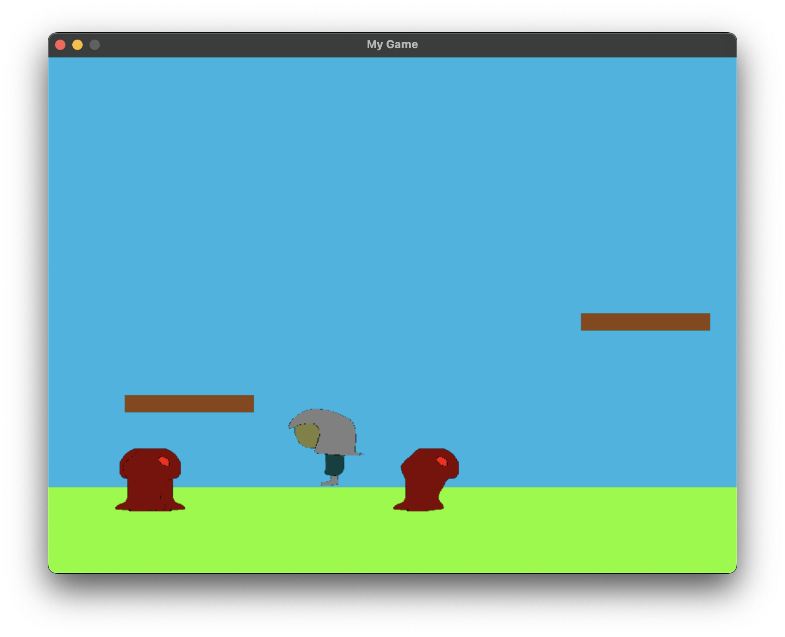

# Stealth Game

It was supposed to be a stealth game but it was too much work for a small demo

## Screenshots



## Controls
(physical keys, it means that if you are on an AZERTY keyboard A is Q)

- "A" -> Move left
- "D" -> Move right
- "Space" -> Attack

## Installation 
 
1. **Clone the repository**:
   ```bash
   git clone [https://github.com/Jean1000levrai/choixpeau.git](https://github.com/Jean1000levrai/Stealth-Game.git)

2. **Install dependencies**:
   ```bash
   pip install -r requirements.txt    # there are 2, pick the right one

3. **Run the application**:
   ```bash
   python3 src/main.py

---
## EasyPyEngine
[EasyPyEngine](https://github.com/Jean1000levrai/EasyPyEngine/releases)
